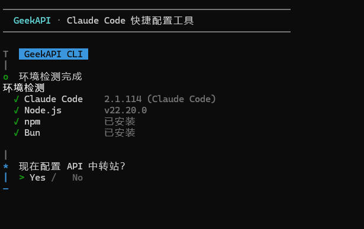
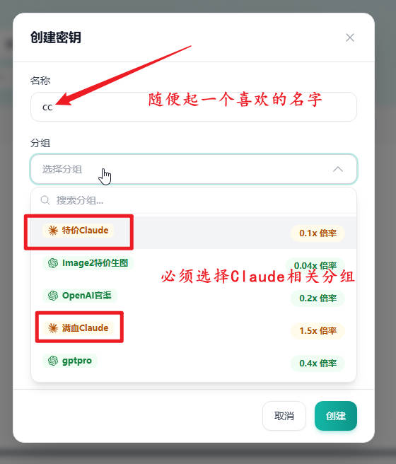
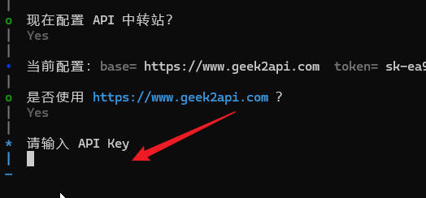

# GeekAPI · Claude Code 快捷配置工具 使用教程

一键完成 Claude Code 的下载、安装和 API 配置，零基础也能用。

***

## 一、是什么

打开后自动检测你电脑上有没有 Claude Code：

* **没装** → 帮你装好运行环境（Node.js）和 Claude Code

* **已装** → 直接进入 API 配置

整个过程只需要回答几个问题，不用手动改任何文件。

<br />



***

## 二、下载

根据你的系统选择对应版本（点击文件名直接下载）：

| 系统                   | 文件名               | 备注           |
| -------------------- | ----------------- | ------------ |
| Windows 10/11        | [`geekapi-win.exe`](https://github.com/CoderKuo/geekapi-cli/releases/latest/download/geekapi-win.exe) | 64 位         |
| macOS（Intel 芯片）      | [`geekapi-mac`](https://github.com/CoderKuo/geekapi-cli/releases/latest/download/geekapi-mac)     | 2020 年前的 Mac |
| macOS（Apple Silicon） | [`geekapi-mac-arm`](https://github.com/CoderKuo/geekapi-cli/releases/latest/download/geekapi-mac-arm) | M1/M2/M3/M4  |
| Linux                | [`geekapi-linux`](https://github.com/CoderKuo/geekapi-cli/releases/latest/download/geekapi-linux)   | x64          |

> 也可以打开 [GitHub Releases](https://github.com/CoderKuo/geekapi-cli/releases) 查看所有版本。

<br />

## 三、运行

### Windows

双击 `geekapi-win.exe` 即可。

### macOS

第一次运行需要授权：

1. 在终端进入文件所在目录，例如 `cd ~/Downloads`
2. 给执行权限：`chmod +x geekapi-mac`（或 `geekapi-mac-arm`）
3. 运行：`./geekapi-mac`

如果提示"无法打开，因为无法验证开发者"：

* 打开"系统设置 → 隐私与安全性"

* 在"安全性"区域找到被拦截的提示，点"仍要打开"

### Linux

```bash
chmod +x geekapi-linux
./geekapi-linux
```

***

## 四、首次使用流程

### 1. 环境检测

工具启动后会自动扫描你的电脑：

* 绿色 ✓ = 已安装

* 红色 ✗ = 未安装

### 2. 安装 Claude Code（如果还没装）

**新手直接选 Node.js**，回车确认。Windows 上会弹出 UAC 授权窗口，点"是"。

安装完成后工具会**自动**继续装 Claude Code。这一步会下载几十 M 内容，等待 1-3 分钟。

> ⚠️ 安装运行时后，请关闭工具，重新双击打开。这是为了让系统识别新装的命令。

### 3. 配置 API

继续走流程，工具会问：**是否使用** **<https://www.geek2api.com>** **？**

* **直接回车**（默认 Yes）→ 用 GeekAPI 中转站

* 选 No → 让你手动输入中转站地址

接下来输入你的 **API Key**：

> 🔑 API Key 在 [GeekAPI 控制台](https://www.geek2api.com) 注册登录后获取，复制粘贴进来即可。粘贴时看不到字符是正常的（密文显示）。

获取方式：

进入 <https://www.geek2api.com>

找到 API密钥

<br />


<br />

创建密钥

<br />


创建配置

<br />



<br />

如果要用CC必须要用支持CC的分组

之后找到刚刚创建的密钥点击复制按钮

<br />


回到工具将复制的密钥粘贴进去

<br />



回车后工具会写入配置

### 4. 启动 Claude Code

回到主菜单，选 **"启动 Claude Code"**：

或者关掉本工具，自己在终端里运行 `claude`。

***

<br />

## 五、常见问题

### Q1：双击 exe 闪退？

打开 PowerShell 或 cmd，cd 到文件目录，手动运行 `.\geekapi-win.exe`，看错误提示。

### Q2：npm 安装 Claude Code 卡住或失败？

国内网络问题。在终端切换镜像后重试：

```bash
npm config set registry https://registry.npmmirror.com
```

然后回到工具，主菜单选"重新安装 / 升级 Claude Code"。

### Q3：装完 Node.js 后工具仍提示找不到？

关闭工具，**重新打开**。系统需要刷新 PATH 环境变量。还不行就重启电脑。

### Q4：我已经在用 Claude Code 官方账号，配置会被覆盖吗？

会。但工具写入前会自动备份到 `~/.claude/settings.json.bak`，需要切回去时把 `.bak` 文件覆盖回 `settings.json` 即可。

### Q5：怎么确认配置生效了？

终端运行 `claude`，正常进入聊天界面就说明可用。如果报 401/403，检查 API Key 是否正确。

### Q6：配置文件存在哪？

* Windows：`C:\Users\你的用户名\.claude\settings.json`

* macOS / Linux：`~/.claude/settings.json`

写入的字段格式：

```json
{
  "env": {
    "ANTHROPIC_BASE_URL": "https://www.geek2api.com",
    "ANTHROPIC_AUTH_TOKEN": "你的 key"
  }
}
```

***

## 七、卸载

本工具是绿色单文件，不需要卸载——直接删除 exe 即可。

如果想同时卸载 Claude Code：

```bash
npm uninstall -g @anthropic-ai/claude-code
```

清理配置文件：

```bash
# Windows
del %USERPROFILE%\.claude\settings.json

# macOS / Linux
rm ~/.claude/settings.json
```

***

## 联系与反馈

* 中转站官网：<https://www.geek2api.com>

